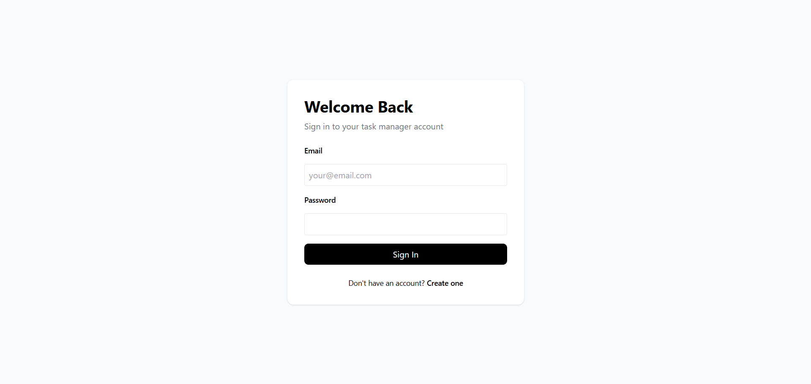
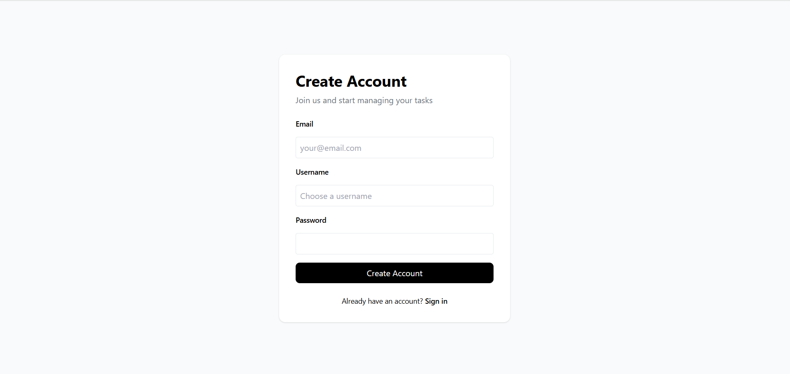
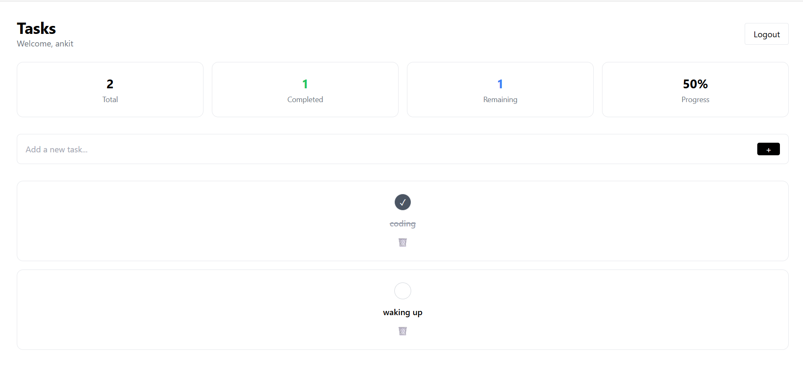

Task Manager ✅📋  
A full-stack task management web application that allows users to create, complete, and track tasks with real-time progress. Built with a clean UI, secure authentication, and deployed on modern cloud platforms.

🔗 Live Demo  
Frontend: https://task-manager-frontend-omega-black.vercel.app/  
Backend: https://task-manager-backend-wn43.onrender.com  

✨ Features  
User authentication (Register / Login)  
JWT-based protected routes  
Create, complete, and delete tasks  
Click-to-complete task interaction  
Automatic progress calculation  
Responsive and clean UI  
Persistent data using MongoDB Atlas  

🛠 Tech Stack  
Frontend  
- React (Vite)  
- Tailwind CSS  
- Axios  

Backend  
- Node.js  
- Express.js  
- MongoDB Atlas  
- Mongoose  
- JWT Authentication  

Deployment  
- Frontend: Vercel  
- Backend: Render  

📸 Screenshots  

Login 


Register 


Task Completion & Progress  


--------------------------
🚀 Getting Started  

Clone the repository:
```bash
-git clone https://github.com/Ankit018348/Task-Manager.git
-cd Task-Manager

--------------------------
Backend setup:
-cd Backend
-npm install
--------------------------
Create a .env file:
-PORT=5000
-MONGO_URI=your_mongodb_atlas_connection_string
-JWT_SECRET=your_secret_key
--------------------------
Run backend:
-npm run dev
-Frontend setup:
--------------------------

Frontend setup: 
-cd frontend
-npm install
-npm run dev
--------------------------

👨‍💻 Author
Ankit Kumar Thakur
Full Stack Developer (MERN)
GitHub: https://github.com/Ankit018348